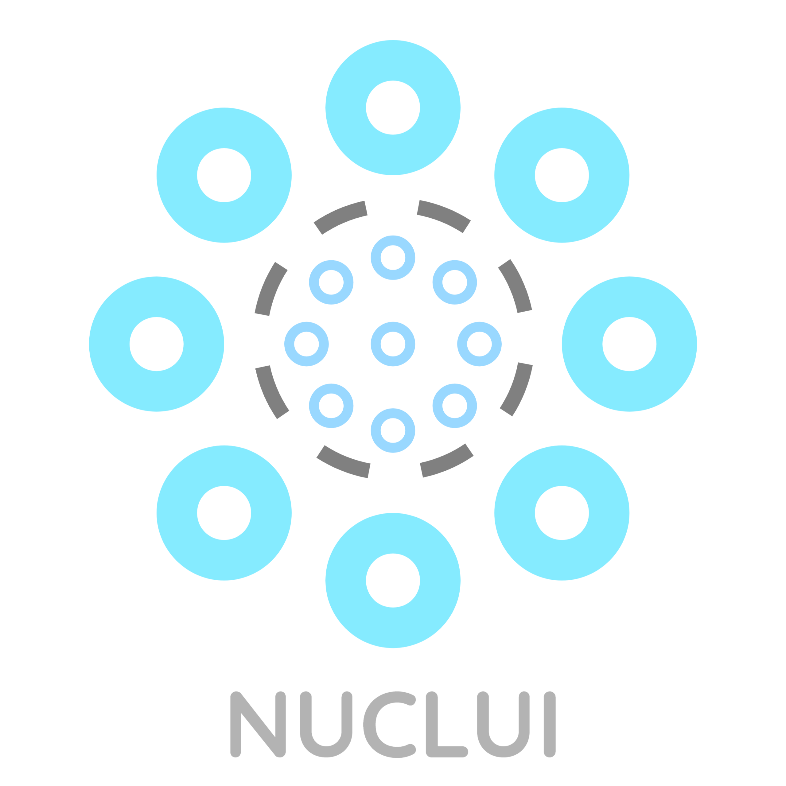

<p align="center">
    <a href="http://nuclui.chintristan.io/">
        
    </a>
</p>
<div align="center">
    [](https://github.com/maxijonson/nuclui/actions?query=workflow%3Atests)
</div>
---

A React UI framework to make your developement easier so you can give more focus on your app and less on the design! It is entirely developed with TypeScript, so it provides full typing support.

## Not production ready!

**WARNING:** Nuclui is currently under development. Some versions may be published to NPM prior to it being ready for your projects for testing purposes! For that reason, it is highly not recommended to use the framework for your projects until an initial version!

## Installation

Use your favorite package manager to install Nuclui!

```bash
npm i nuclui
```

or

```bash
yarn add nuclui
```

## Contributing

Nuclui is under development and is not yet production ready. The components and other features are highly subject to change. For that reason, I ask that you hold your contributions until an initial stable version. Thanks for your understanding!

## FYI

-   Nuclui is a reboot of a previous unfinished React library: [tchin-react-components](https://github.com/maxijonson/tchin-react-components).
-   Although some docs specific dependencies are declared in the `dependencies` of [package.json](./package.json), they are stripped out before publishing to NPM using [scripts](./scripts/prepublishOnly.js). Since the docs are hosted on Heroku, this was necessary in order to make the docs work while keeping these docs specific dependencies out of the final product. I am aware this is a hacky solution and [I am looking for cleaner alternatives](https://stackoverflow.com/questions/62460197/how-do-you-exclude-certain-dependencies-from-being-published-with-npm).
